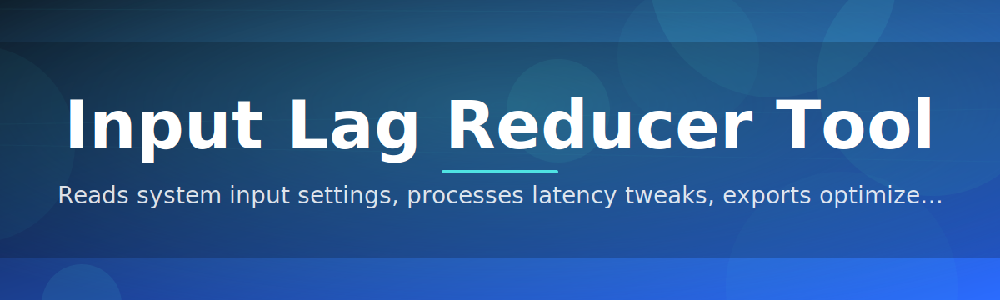
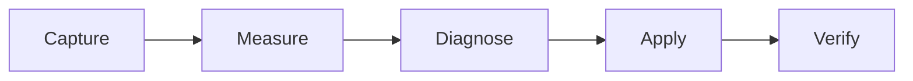

# input-lag-reducer-tool ⚡🎮

  

*Shave real milliseconds off every click, keystroke, and mouse flick — no snake oil, just measured latency reduction.*

  

---

## 🧠 What This Is NOT

Let's clear the air first. **input-lag-reducer-tool** is *not* a magic FPS booster, it's *not* a driver-level rootkit poking around your kernel, and it's *not* one of those shady "gaming optimizer" apps that just disables half your OS and calls it a day. We're allergic to snake-oil marketing.

What it **actually is**: a focused, transparent, open-source utility that targets the specific pipeline stages where input latency sneaks in — polling intervals, buffering, scheduler jitter, and display sync mismatches — and trims them down with real, measurable techniques. Every optimization it applies is inspectable, toggleable, and logged.

## 🔎 Overview

Input lag is death by a thousand cuts. It's not one big villain — it's USB polling rate, it's your mouse driver batching events, it's Windows' power plan throttling your CPU mid-frame, it's a compositor adding an extra buffer "just in case." Individually these delays are invisible. Stacked together, they're the difference between a flick shot landing and a flick shot missing by a hair.

**input-lag-reducer-tool** exists because competitive gamers, rhythm-game players, sim racers, and anyone who's ever screamed "that should have hit!" deserve tooling that actually explains *where* the milliseconds go instead of just promising vague "FPS boosts." It was built by people who got tired of latency myths floating around forums with zero benchmarks behind them.

Who it's for: esports grinders chasing frame-perfect reaction windows, streamers who want buttery input feel without buying new hardware, and everyday Windows users who just want their clicks to feel instant again. If you've ever wondered whether your setup is quietly working against you, this tool gives you the receipts.

---

## 🚀 The Feature Lineup That Actually Moves the Needle

  

- **Real-Time Latency Graphing** — A live, scrolling waveform of end-to-end input delay, sampled at sub-millisecond resolution, so you can *see* the spike instead of just feeling something's off.

- **Polling Rate Normalizer** — Automatically detects mismatched USB polling intervals across mouse/keyboard/controller and aligns them so events don't queue up waiting for each other.

- **Scheduler Priority Tuning** — Nudges the input thread's process priority and CPU affinity without touching anything system-critical, keeping your input pipeline from getting starved during heavy frametime spikes.

- **Display Sync Advisor** — Reads your monitor's refresh behavior and recommends the sync mode (or lack thereof) that minimizes render-to-photon delay for your specific panel.

- **Power Plan Sanity Check** — Flags Windows power settings that silently throttle CPU clocks between inputs, then offers a one-click latency-optimized profile.

- **Background Noise Auditor** — Scans running services and startup tasks for known latency offenders — background telemetry, indexing, overlay hooks — and reports impact without nuking anything blindly.

- **Snapshot & Rollback** — Every change is versioned. Don't like a tweak? Roll it back instantly, no registry archaeology required.

- **Session Reports** — Exportable before/after latency reports in plain CSV, perfect for benchmarking hardware changes or bragging rights on forums.

> [!TIP]
> Run a baseline scan *before* changing anything. The before/after delta is honestly the most satisfying part of using this tool.

---

## 🏁 Getting Up and Running

1. Visit the landing page via the download button above or below.

2. Grab the latest standalone build — no installer wizard, no bundled bloat.

3. Run the executable. Windows SmartScreen may flag it since it's a smaller open-source project — click "More info" → "Run anyway."

4. Hit **Scan** to get your baseline latency profile, then apply the recommended optimizations one by one.

> [!NOTE]
> First launch runs a 10-second calibration pass to fingerprint your hardware's polling behavior. Don't touch your mouse during this — yes, we know that's ironic.

---

## 🖥️ System Requirements

| Component | Minimum | Recommended |
|---|---|---|
| OS | Windows 10 (64-bit) | Windows 11 |
| RAM | 2 GB free | 4 GB free |
| Disk | 50 MB | 100 MB |
| Dependencies | None — fully standalone | None |
| Admin rights | Optional | Recommended for full scheduler tuning |

> [!IMPORTANT]
> This is a **standalone executable**. No .NET runtime downloads, no background installers, no dependency chains to chase. Download it, run it, done.

---

## ⚙️ How It Works

The tool operates in a simple, transparent loop rather than a black-box "optimize everything" button:

1. **Capture** — Hooks into the input event stream at the driver-adjacent level to timestamp every event.
2. **Measure** — Cross-references timestamps against render and display output to compute true end-to-end lag.
3. **Diagnose** — Identifies which stage (device, OS, scheduler, display) is contributing the most delay.
4. **Apply** — Suggests and applies targeted, reversible tweaks per stage.
5. **Verify** — Re-measures to confirm the fix actually helped — no guessing games.

---

## 🩹 Troubleshooting

<strong>The latency graph shows random spikes even when I'm not touching anything.</strong>

 

That's usually background polling from wireless peripherals or a Bluetooth stack doing housekeeping. Check the Background Noise Auditor tab — it'll usually name the culprit.

<strong>Windows Defender / SmartScreen flagged the download.</strong>

 

Expected for smaller open-source binaries without a paid code-signing certificate. The tool is unsigned but fully open — check the source, verify the hash on the landing page, and proceed if you're comfortable.

<strong>I applied the scheduler tuning and my system feels the same.</strong>

 

Scheduler tuning helps most on systems with heavy background load. If your CPU was already lightly loaded, the improvement will be marginal — check the Session Report to see the actual delta in milliseconds.

<strong>Can I use this alongside other gaming utilities or driver software?</strong>

 

Generally yes. Conflicts mostly arise with tools that also hook input at a low level (macro managers, certain overlay software). If you see doubled inputs or erratic readings, try disabling one at a time.

<strong>Does this work for wireless controllers/mice too?</strong>

 

Yes, though wireless adds its own latency floor from RF polling. The tool will report this honestly rather than pretending it can eliminate physics.

---

## 🎨 UI, UX & Personalization

- **Dark / Light / High-Contrast themes** — toggle via `Ctrl+Shift+T`.
- **Quick Scan shortcut** — `F5` triggers an instant re-measurement without opening menus.
- **Pin to system tray** — keep the live latency graph one click away while gaming.
- **Custom sampling rate** — adjust granularity for lower-end systems that can't handle ultra-fine polling.
- **Export shortcut** — `Ctrl+E` dumps the current session report to CSV.

> [!TIP]
> Pin the tray widget and glance at it during a match — spotting a spike *while it happens* is way more useful than reading about it after.

---

## 🤝 Contributing & Community

This project grows because people who care about latency keep poking at it. Contributions, benchmark data, and bug reports are all genuinely welcome.

- Open an issue for bugs, feature ideas, or "this reading looks wrong on my hardware" reports.
- Pull requests should include before/after latency data where relevant — numbers talk.
- Join discussions to compare setups, share configs, and geek out over microsecond-level tuning.

> [!WARNING]
> Please don't submit PRs that touch kernel-level drivers or anything requiring elevated system hooks beyond what's already scoped. Keep the project auditable and safe for everyone.

---

## 📜 License

Released under the [MIT License](LICENSE), 2026. Use it, fork it, learn from it, ship it in your own projects — just keep the license notice intact.

---

## ⚠️ Disclaimer

This tool measures and adjusts software-level and OS-level settings that influence input latency. It does not modify game files, does not interact with anti-cheat systems, and makes no guarantees about specific millisecond improvements — results vary by hardware, drivers, and system load. Use standard caution with any system-tuning utility and keep backups of your configuration where possible.

